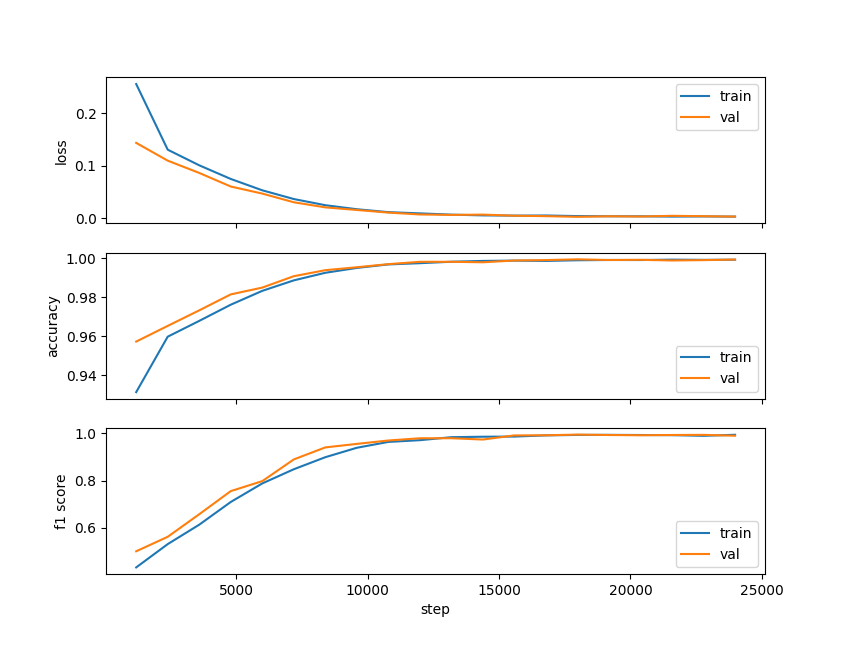
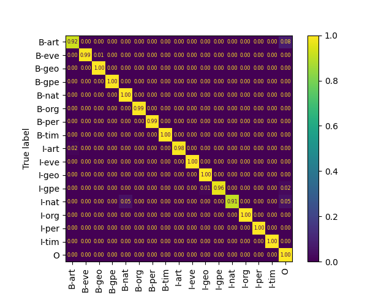

# Named Entity Recognition in PyTorch

Named Entity Recognition in PyTorch using BERT model and [Named Entity Recognition (NER) Corpus](https://www.kaggle.com/datasets/naseralqaydeh/named-entity-recognition-ner-corpus) from Kaggle.

Dataset is randomly split into 80% train-validation split.

## Training results 

Model was trained for 20 epochs. Labels in dataset are inbalances so except accuracy F1 score (macro) was used.

### Confusion matrix normalized along "True label" axis
